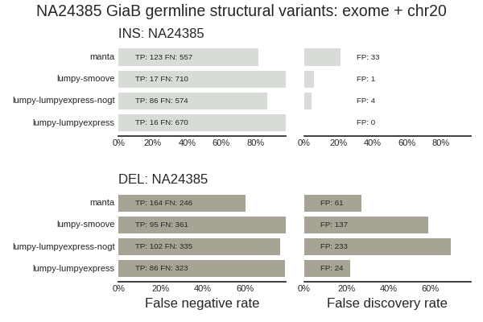

# Genome in a Bottle NA24385 SVs

Genome in a Bottle NA24385 (HG002) v0.5.0 calls from:

ftp://ftp-trace.ncbi.nlm.nih.gov/giab/ftp/data/AshkenazimTrio/analysis/NIST_UnionSVs_12122017/

Individual aligner calls from Andrew Carroll from e-mail 20 Jan 2018

## Illumina detection ability

I've been working with Andrew Carroll on assessing the limits of detection for
standard Illumina short reads compared to the NA24385 v0.5.0 truth set.
Recent papers that combine long and short read calling provide some rough
estimates about how much we can expect to detect with just short reads:

- Deletions (61%); insertions (54.3%) -- https://www.biorxiv.org/content/early/2017/09/23/193144
- Up to 61% -- http://genome.cshlp.org/content/early/2016/11/25/gr.214007.116.abstract

and the results below roughly recapitulate these with some additional color
around sizes and insertion types that might be useful. This gives us some
boundaries around detection efficiencies we can reasonably expect and also helps
validate that our approaches match what others see with similar data inputs.

To start, I looked through support from different platforms within the truth
set. To break it down into categories, I split into types (deletions, insertions and
other complex event) and event sizes (smaller <2kb and bigger >=2kb). Illumina, 10x
and PacBio support drive most of the calls (>10% of calls in any category), so I used
these for breaking down event types across platforms:

Platform support in truth set
```
|               | 10X + Ill + PB | Ill + PB      | Ill          | PB           |
|---------------|----------------|---------------|--------------|--------------|
| <2kb DEL      | 3482 (15.1%)   | 9797 (42.5%)  | 5843 (25.3%) | 1365 (5.9%)  |
| >=2kb DEL     | 404 (75.5%)    | 81 (15.1%)    | 12 (2.2%)    | 25 (4.7%)    |
| <2kb INS      | 1841 (7.3%)    | 10138 (40.2%) | 5696 (22.6%) | 4692 (18.6%) |
| >=2kb INS     | 151 (22.6%)    | 124 (18.6%)   | 2 (0.3%)     | 347 (52.0%)  |
| <2kb COMPLEX  | 95 (15.5%)     | 79 (12.9%)    | 39 (6.4%)    | 357 (58.4%)  |
| >=2kb COMPLEX | 30 (23.1%)     | 19 (14.6%)    | 0 (0.0%)     | 68 (52.3%)   |
```

The primary category of events we expect to miss with Illumina only reads are
larger insertions, and complex non-indel events, where 50%+ have only PacBio
support. This is primarily in line with the papers above, although we're able to
do better than predicted with Illumina deletions, detecting a majority of these with
at least one of the calling methods.

To get a sense of how we'd do with a single caller and Illumina reads in a more
standard analysis pipeline, here is a breakdown by SV type for Manta call
sensitivity on Illumina reads:

Illumina + Manta sensitivity
```
| <2kb DEL      | 7988 (34.6%) |
| >=2kb DEL     | 443 (82.8%)  |
| <2kb INS      | 7709 (30.6%) |
| >=2kb INS     | 263 (39.4%)  |
| <2kb COMPLEX  | 299 (48.9%)  |
| >=2kb COMPLEX | 65 (50.0%)   |
```

This provides a bit more color on the results above. We're still doing best on
deletions, but do better on the large events probably because of improved
discrimination ability from paired read insert deviations. We perform about the
same on both larger and smaller insertions and complex variants, from 30-50%
sensitivity. This is in contrast to the summarized results above where Illumina
methods do much better on small insertions than large ones, indicating some of
the algorithms we're using for the consensus set improve on what Manta can do
alone.

## Smoove validation

[smoove](https://github.com/brentp/smoove) simplifies and improves the process
of calculating [lumpy structural variation
calls](https://github.com/arq5x/lumpy-sv). Previously bcbio made use of
[lumpyexpress](https://github.com/arq5x/lumpy-sv#lumpy-express-usage) and custom
code to call genotypes with [svtyper](https://github.com/hall-lab/svtyper).

The comparison uses [50x HiSeq x10 data from
10x](https://github.com/bcbio/bcbio_validation_workflows#joint-calling-validation-workflow-with-genome-in-a-bottle-samples)
subset to chromsome 20 and exome regions in other chromosomes, compared against
the in progress [Genome in a Bottle NA24385 (HG002) v0.5.0 truth
set](ftp://ftp-trace.ncbi.nlm.nih.gov/giab/ftp/data/AshkenazimTrio/analysis/NIST_UnionSVs_12122017/).

We compare lumpy with smoove versus a custom lumpyexpress plus svtyper, plus
manta structural variant calls as an additional datapoint. [SURVIVOR
merge](https://github.com/fritzsedlazeck/SURVIVOR/wiki/Methods-and-Parameter#4-merge-or-consensus-calling-from-multiple-sv-vcf-files)
combined the truth and evaluation callsets using flexible breakend comparisons.
The comparisons include lumpyexpress with and without strict genotyping: `nogt`
allows non heterozygous or homozygous variant calls in the output as well to
demonstrate possible sensitivity of calls:



Not reflected in the validations are a large number of non-insertion and
deletion events that genotyping and smoove remove: 6909 duplications with no
genotype lumpyexpress versus 331 with smoove; 8752 inversions with no genotype
lumpyexpress versus 1141 with smoove; 425 translocations with no genotype
lumpyexpress versus 1 with smoove. While we don't have validations for these
events, this is a substantial reduction in likely extra noisy calls.

The smoove implementation has comparable sensitivity and specificity to the
custom lumpyexpress implementation using genotyping. However both are less
sensitive than manta or lumpy calling that ignores genotyping. We'll continue to
tune to improve outputs for this dataset and additional comparison data for
orthogonal validations.
