# Heterogeneity Analysis

## TCGA LUAD

Characterize low frequency variant calls, copy number calls, purity and ploidy
in [TCGA Lung Adenocarcinoma (TCGA
LUAD)](https://portal.gdc.cancer.gov/projects/TCGA-LUAD) samples. We lack full
truth sets for somatic heterogeneity calling, so this attempts to take advantage
of available TCGA samples that also have associated external data, like
[systematic pan-cancer analysis of tumour purity](https://www.nature.com/articles/ncomms9971).
It compares multiple methods and outcomes to help improve preparation of
heterogeneity inputs (CNVs and small variants).

The TCGA LUAD samples are exome tumor/normal pairs,
[sequenced by the Broad Institute with a custom Agilent capture
panel](https://journals.plos.org/plosone/article?id=10.1371/journal.pone.0204912).
This appears to be `whole_exome_agilent_1.1_refseq_plus_3_boosters.targetIntervals.bed`
from this [cghub bitbucket repository](https://bitbucket.org/cghub/cghub-capture-kit-info).

## TCGA-05-4395

This sample features a several large deletion/LOH events, as well
as some large amplifications. Because of the instability, both PureCN and
TitanCNA prefer solutions with an overall ploidy of around 3.
PureCN calculates a purity of 0.58 and a ploidy of 3.2. The diploid solutions
for purity/ploidy also have low purity. TitanCNA has a similar solution, with a
purity of 0.57 and a ploidy of 2.9.
TCGA supplied purity estimates range from 0.61-0.80; the low side is in the
range of TitanCNA and PureCN estimates, so this is a promising output.

We don't see evidence for LOH in chr6 HLA regions, in either the copy number or
allele frequency data.

### CNVkit
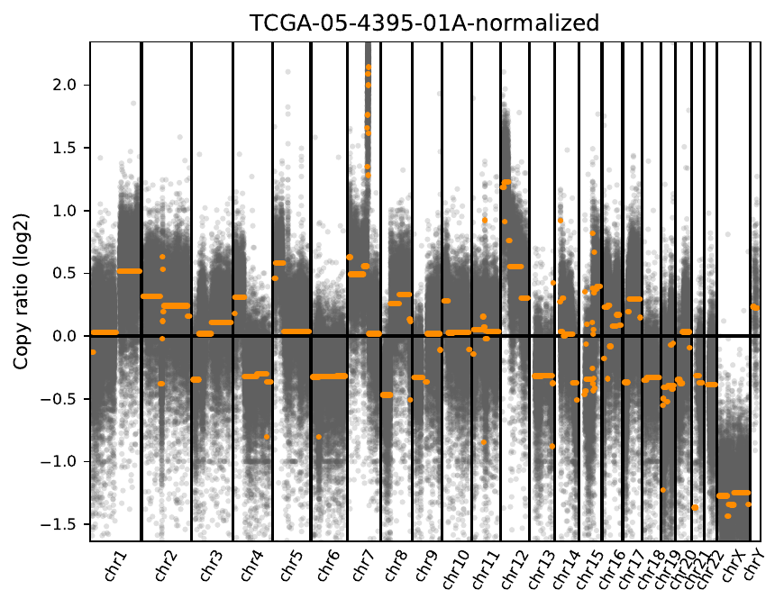

### TitanCNA

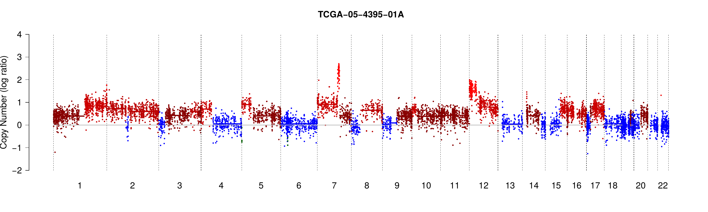
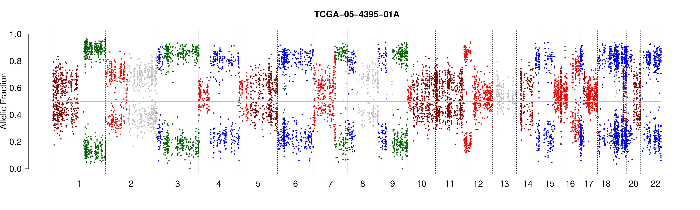

### PureCN
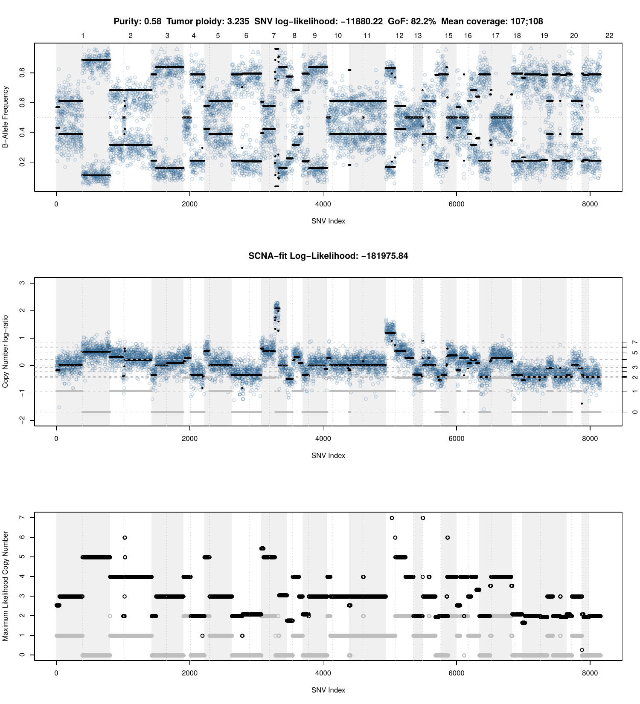
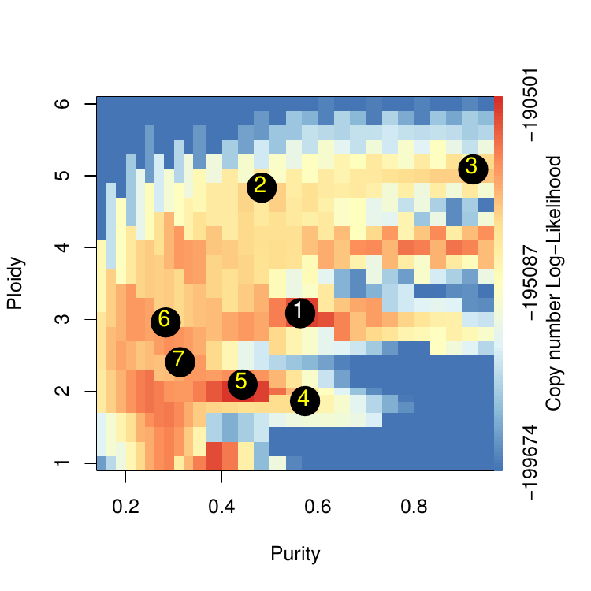

### PURPLE

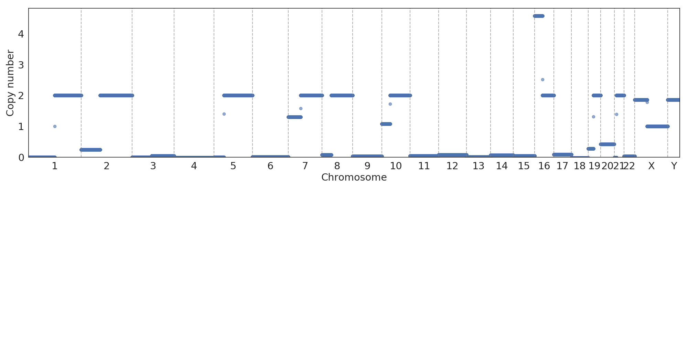

## TCGA-05-4396

This sample has more overall stability with few high copy number regions but
several whole/large chromosome deletion/LOH events. Both PureCN and TitanCNA
prefer ploidy/purity estimates with high overall ploidy of 4. PureCN calculates
a low purity (0.36) and high ploidy (3.8) while TitanCNA finds 3 subclones, a
purity of 0.87 and a ploidy of 3.5. PURPLE calculates a purity of 0.98 with a
ploidy estimate of 0 and estimates a large number of the genome as zero copy.
TCGA supplied purity estimates range from 0.75-0.89, so the PureCN
calculation here seem to overestimate normal contamination. There is a solution
with purity of 0.79 and ploidy of 1.9 that would seem to better fit with other
estimates, although it has a goodness of fit of 0%. We need to explore how to
prioritize the diploid solutions for these more unstable/LOH cases.

We don't see evidence for LOH in chr6 HLA regions, in either the copy number or
allele frequency data.

### CNVkit

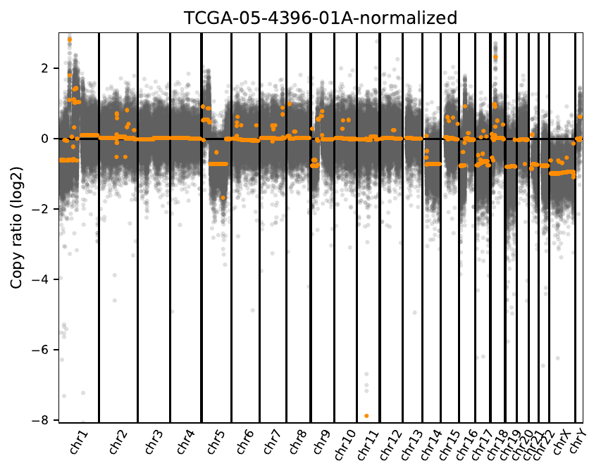

### TitanCNA

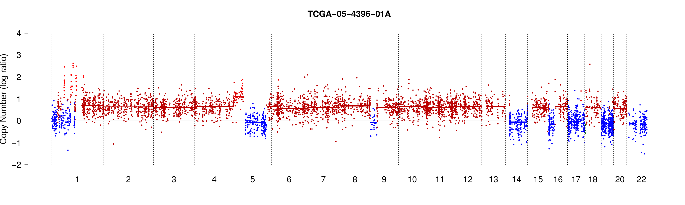
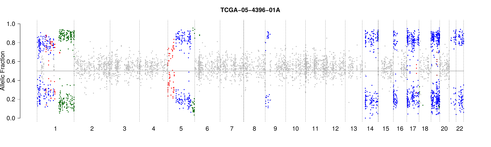

### PureCN

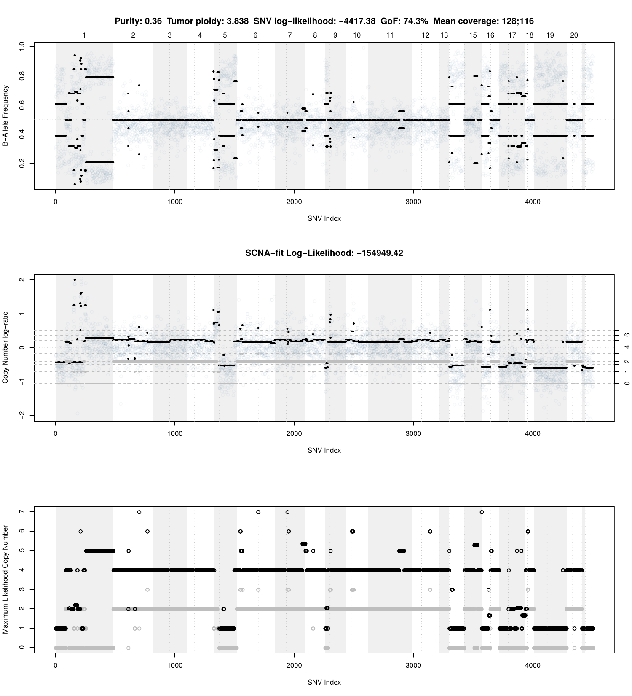
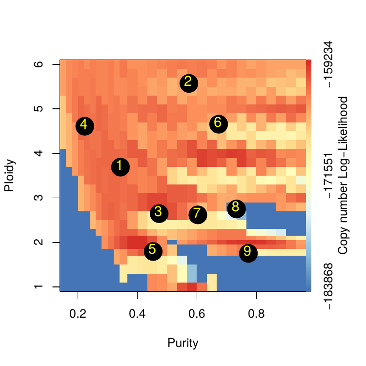

### PURPLE

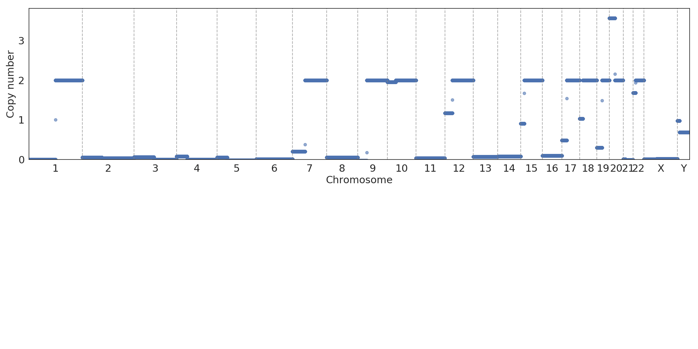
