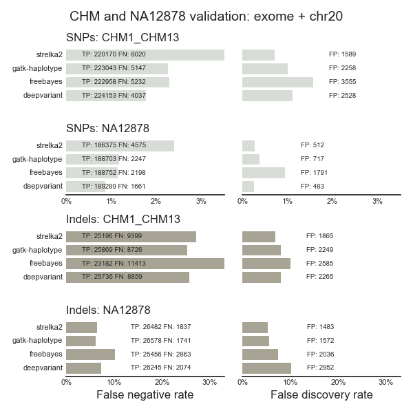
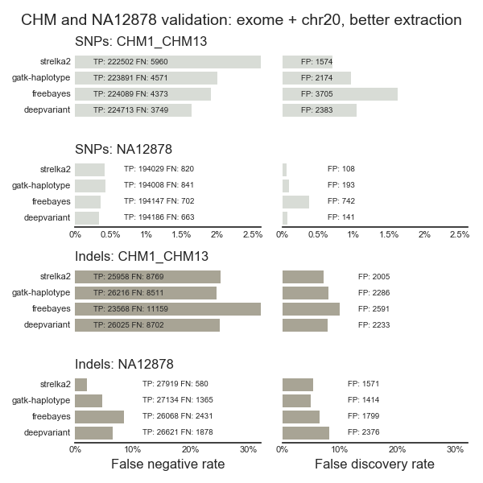

# DeepVariant validations

Validations of [DeepVariant](https://github.com/google/deepvariant) with Genome
in a Bottle and [the CHM based synthetic diploid truthset](https://gatkforums.broadinstitute.org/gatk/discussion/10912/what-is-truth-or-how-an-accident-of-nature-can-illuminate-our-path).

- [Description of inputs and running](https://github.com/bcbio/bcbio_validation_workflows#synthetic-diploid-chm-and-genome-in-a-bottle)
- [CWL workflow](https://github.com/bcbio/bcbio_validation_workflows/tree/master/giab-chm)

## CHM and NA12878 from Genome in a Bottle

The CHM dataset with filtering for problematic indels (1bp and >50bp) looks
reasonably comparable to NA12878. It has ~2x more false negatives for SNPs and
~4x more false negatives for indels, so either has potential noise or is
identifying regions that Illumina based callers fail to identify.
DeepVariant has improved sensitivity on SNPs for both NA12878 and CHM,
indicating that training on Genome in a Bottle inputs does not bias towards
those samples.

Versions:
- hg38 genome build
- GATK4.0b6
- FreeBayes 1.1.0.46
- strelka 2.8.4
- DeepVariant 0.4.1

### Resources

- [NA12878 false positives for GATK4 and DeepVariant](https://s3.amazonaws.com/chapmanb/validation/giab-chm/NA12878-gatk4-dp-fps.tar.gz) 

## Revised CHM and NA12878 with improved prep

Mark Depristo from the Google DeepVariant team and Sangtae Kim from the Illumina
Strelka2 team both pointed out a potential issue with the prepared BAM files in
exome and chr20 regions that might introduce additional bias. These are prepared
by subsets of whole genome BAM files to read pairs mapping in exome regions,
which introduces unexpected bias in strandedness and mate placement for
remaining reads. To avoid this we re-prepared the BAMs keeping any read pairs
where either end maps in exome (or chr20 regions) and then variant calling only
in exome regions.

Comparing and contrasting the two BAM preparation methods:

We see:

- Better NA12878 SNP sensitivity and specificity in the improved BAM 
  preparation method.
- Some improvement in NA12878 indel sensitivity and specificity, but not as
  much as the indel improvement.
- Very little change in CHM for specificity, but some improvement in
  sensitivity, especially for SNPs.

This indicates that both machine learning based methods like DeepVariant and
filter based methods like HaplotypeCaller, Stelka2 and FreeBayes pick up on
Illumina specific features in the Genome in a Bottle truth sets. This is
especially relevant for SNP calling. Since the PacBio only CHM dataset
does not show the same improvements, we're removing an interdependence
between Illumina inputs and evaluations or introducing errors
resilient to current metrics used for filtering.

Versions as above with an update to GATK4 release:
- GATK 4.0.1.0
