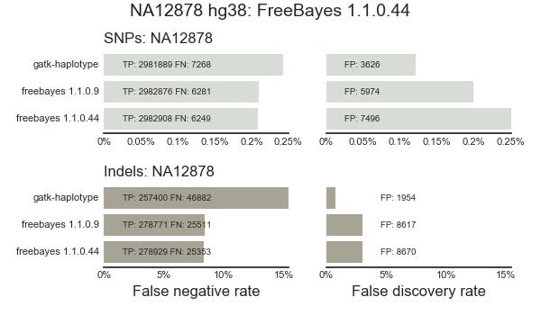

# FreeBayes

FreeBayes validation runs on version changes and other updates

## 1.1.0.44

Tests updates to FreeBayes from issue [#402](https://github.com/ekg/freebayes/pull/402) that include:

- Improved handling of complex alleles
- support for htslib 1.5, enabling bioconda compatibility

Validated against [a whole genome 50x NA12878 sample](https://github.com/chapmanb/bcbio-nextgen/blob/master/config/examples/NA12878-hg38-validate-getdata.sh) using build hg38 the Genome in a Bottle 3.3.2 truth set:

The updated version performs similarly to the previous, with slightly more
sensitivity and slightly less precision. The GATK comparable is 4.0a1.2.7.2.

The variant calling wall clock runtime on AWS m4.2xlarge (8 cores and 4Gb memory/core) was 15:36.
