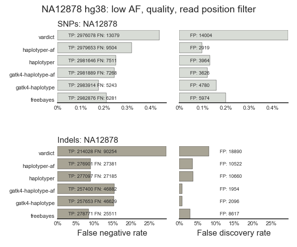
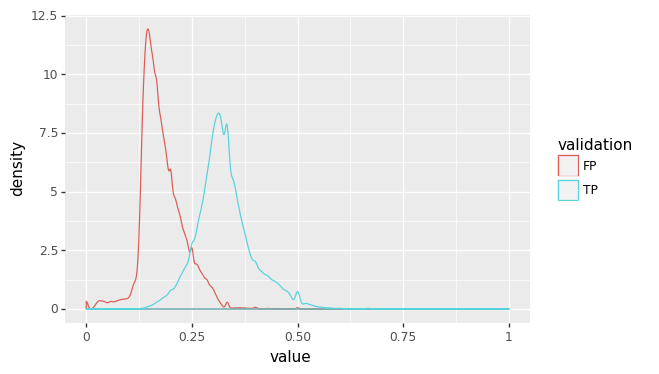
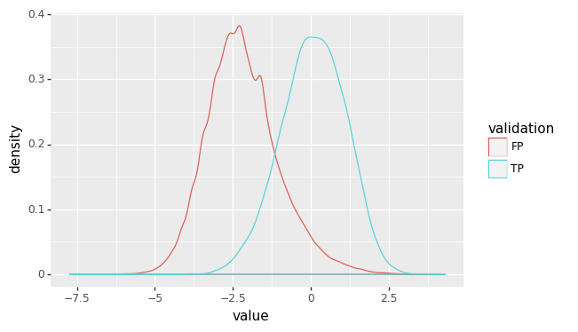
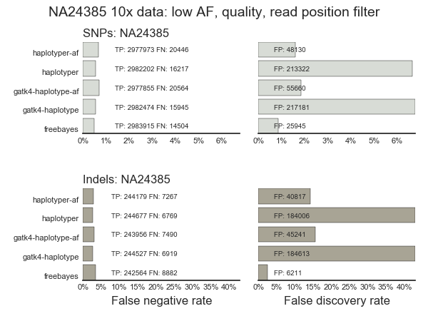
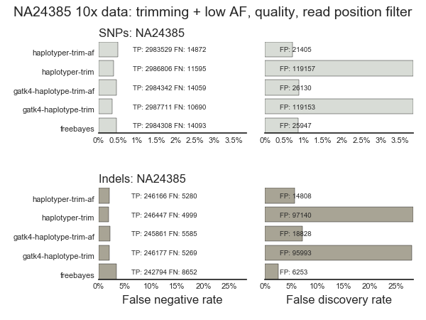
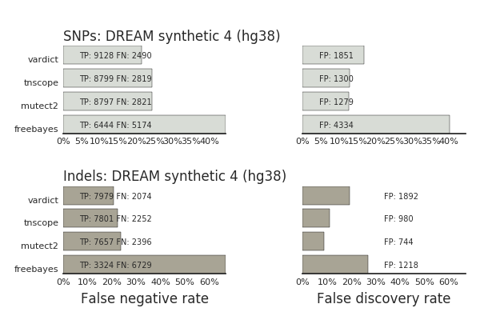
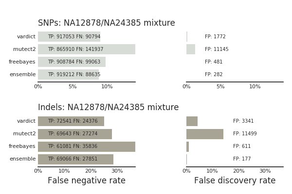

# GATK4 validation

Validation runs of the new open source GATK4 release

## NA12878 hg38

NA12878 validation using [50x HiSeq 2000 data](http://www.ebi.ac.uk/ena/data/view/PRJEB3381) from
[Illumina Platinum Genomes](https://www.illumina.com/platinumgenomes.html)

For GATK4, this comparison includes runs with the Strand Odds Ratio (SOR) included
(`gatk4-haplotype-sor`) and excluded (`gatk4-haplotype`). The
[GATK best practice hard filter recommendations](https://software.broadinstitute.org/gatk/documentation/article?id=2806) include this additional strand bias filter. It improve specificity (~2000 FPs removed)
at the cost of lowering sensitivity (~6000 TPs lost). We don't include the SNP
SOR filter in bcbio to avoid the loss in sensitivity.

The new quality score calculations in GATK4 reduces indel sensitivity
(~26k TPs removed) compared to GATK3 quality scores, but do improve specificity
(~11k FPs removed). We'll explore QD filter tuning in bcbio to help restore some
of the lost sensitivity.

Wall clock timings on AWS m4.4xlarge (16 cores), measured via log timestamps:

- FreeBayes: 6:23
- GATK3: 9:56
- GATK4: 6:05
- VarDict: 2:39
- Sentieon haplotyper: 2:23

Versions:
- hg38 genome build
- GATK4.0a1.2.7.2
- FreeBayes 1.1.0
- GATK3.7
- VarDict 1.5.0
- Sentieon Haplotyper 201704
- Genome in a Bottle NA24385 truth set v3.3.2

### Low frequency allele filter

The low frequency allele filter, used below to eliminate noise in 10x input
data, also provides improved specificity with a small cost to sensitivity:

## NA24385 10x data on GRCh37

NA24385 validation using
[50x HiSeqX inputs from 10x genomics](https://support.10xgenomics.com/de-novo-assembly/datasets).
This explores the role of trimming and low allele frequency filters for
improving sensitivity and specificity of analyzing 10x data.

### bcbio original

GATK based approaches appear to over-call likely due to soft-clipped adapters.
We need to explore approaches to filter and remove these. GATK3, GATK4 and
Sentieon haplotyper perform similarly.

Wall clock timings on AWS m4.4xlarge (16 cores), measured via log timestamps:

- FreeBayes: 9:34
- GATK3: 15:59
- GATK4: 25:22
- Sentieon haplotyper: 11:47 -- not full utilization at end, waiting for a few
  slow regions to finish (@10:49313060 -- 7:30, @16:49979430 -- 5:30); Need to
  retest with improved bcbio region sorting; could
  also likely improve with downsampling

Versions:
- GRCh37 genome build
- GATK4.0a1.2.7.2
- FreeBayes 1.1.0
- GATK3.7
- Sentieon Haplotyper 201704
- Genome in a Bottle NA24385 truth set v3.3.2

### Low frequency allele filter

On the 10x community forum, the 10x genomics team
[recommended using an allele frequency based filter](https://community.10xgenomics.com/t5/Genome-Exome-Forum/Best-practices-for-trimming-adapters-when-variant-calling/m-p/473) to
avoid false positives. This helps segregate true positive and false positives
from the initial validation:

Since there is an overlap in the tails of the true positive and false positives,
we looked for an additional variable to filter on, and settled on
ReadPosRankSum:

The final filter then removes low quality, low allele frequency calls at the
ends of reads:

    QD < 10.0 && AD[1] / (AD[1] + AD[0]) < 0.25 && ReadPosRankSum < 0.0

This provides more than a 3x improvement in specificity compared with the
original calls, with a slight reduction in sensitivity.

In this plot, `-af` values have the low allele frequency filter applied.

### 10x adapter trimming + low frequency allele filter

The 10x genomics team
[also recommended trimming of inputs](https://community.10xgenomics.com/t5/Genome-Exome-Forum/Best-practices-for-trimming-adapters-when-variant-calling/m-p/473):

> In terms of trimming, we recommend trimming the first 16+7bp of R1, and the
> first 1bp of R2. R1 contains the 16bp 10x barcode + 7bp of low accuracy
> sequence from an N-mer oligo. The first bp of R2 empirically has about a 5x
> higher mismatch rate.

The low frequency filter on untrimmed reads did not fully resolve false positive
issues, likely due to the low accuracy R1 bases not at the end of the reads. To
explore trimming, we removed the adapters and low quality bases prior to
alignment and variant calling. Below are the results for trimming only (`-trim`)
and trimming plus the low frequency allelef filter (`-trim-af`):

- Trimming removes about half of the false positives, but still leaves poor
  specificity compared to FreeBayes.
- Trimming and the allele frequency filter make SNP detection specificity on-par
  with FreeBayes.
- There are still 2-3x more indel false positives compared to FreeBayes, but
  with improved sensitivity.
- Sensitivity of trimmed and filtered variants is better than original
  untrimmed/unfiltered analysis.

Wall clock timings on AWS m4.4xlarge (16 cores), measured via log timestamps:

- FreeBayes: 8:59
- GATK4: 39:52
- Sentieon haplotyper: 15:02

## Germline joint calling

[Three Genome in a Bottle samples (NA12878, NA24385, NA24631)](https://github.com/bcbio/bcbio_validation_workflows#joint-calling-validation-workflow-with-genome-in-a-bottle-samples)
with different sequencing methods: NovaSeq, HiSeq X10 with 10x linkers and HiSeq
2500, respectively. The initial inputs were whole genome runs that we subset to
exome regions plus all of chr20 to reduce runtimes. We compared the impact of
Base Quality Score Recalibration (BQSR) on the inputs:

BQSR improves specificity as the cost of some loss in sensitivity for both SNPs
and indels. The biggest impact is on the NA24385 dataset, sequenced on a HiSeq X10
machine and including 10x linker sequences.

## Somatic DREAM synthetic 4

We validated somatic mutation detection with GATK4 MuTect2 using the
[ICGC-TCGA DREAM challenge synthetic 4 dataset](https://www.synapse.org/#!Synapse:syn312572/wiki/62018).
This sample has 80% cellularity and sublclones at 30% and 15%. 

Wall clock timings on AWS m4.4xlarge (16 cores), measured via log timestamps:

- FreeBayes: 8:29
- GATK4 MuTect2: 5:09
- VarDict: 3:51
- Sentieon tnscope: 1:41

## Somatic NA12878/NA24385 mixture

This is a sequenced mixture dataset of two Genome in a Bottle samples simulating
a lower frequency set of call. It has a 90x tumor genome consisting of 30% NA12878 
(tumor) and 70% NA24385 (germline) and a 30x normal genome of NA24385. Unique
NA12878 variants are somatic variations at 15% and 30%.

Wall clock timings on AWS m4.4xlarge (16 cores), measured via log timestamps:

- FreeBayes: 31:21
- VarDict: 25:43
- GATK4 MuTect2 (4.0b3): 62:46
