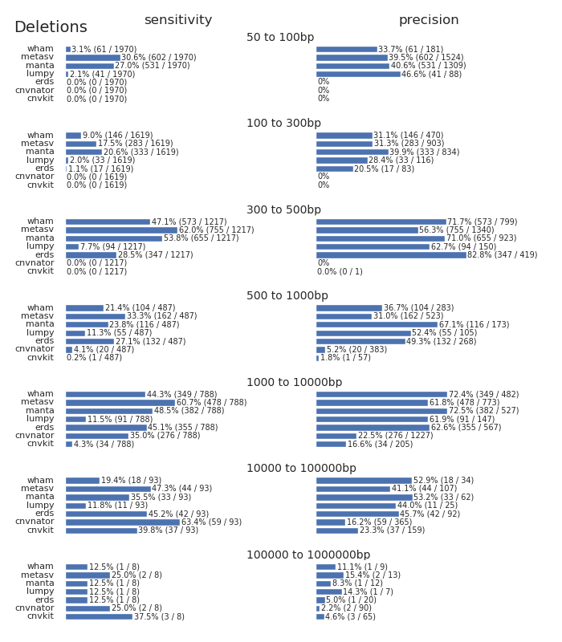
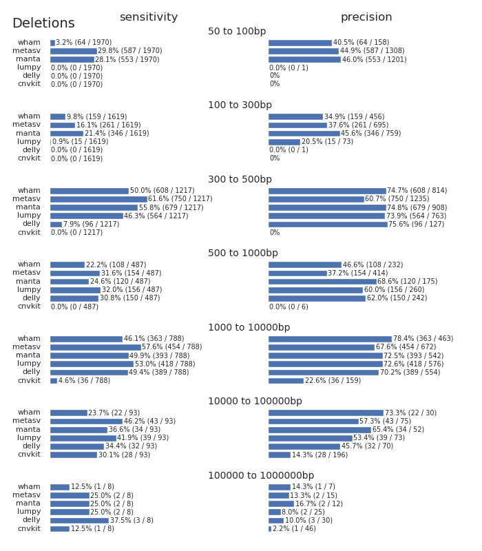

# Validation of structural variant (SV) calling in bcbio using HuRef benchmark

* Benchmark (DEL calls)
[Trost2018](http://www.cell.com/action/showImagesData?pii=S0002-9297%2817%2930496-2)  
I used an updated benchmark (personal communication from Brett Trost), which includes calls from PacBio:
7,952 deletions after bedtools merge, sizes: [50 – 171,021,482].  
For comparison, GIAB’s NA12878 truth_DEL.merged.bed has 2,668 deletions of [50 - 139,620].
* Raw data: https://www.ncbi.nlm.nih.gov/sra/SRX5395595[accn]

## 1. Prepare input data:
```
module load sratoolkit
prefetch -c SRR8595488 --max-size 60GB
qsub ~/bioscripts/fastq.sra2fq.sh -v srr=SRR8595488,sample=huref_blood1
```
Result
```
38G	huref_blood1_1.fq.gz
42G	huref_blood1_2.fq.gz
```

## 2. Align to grch37 with decoy

```
details:
- algorithm:
    aligner: bwa
    effects: false
    mark_duplicates: true
    realign: false
    recalibrate: false
    save_diskspace: true
    tools_on:
    - svplots
    - qualimap
    variantcaller: false
  analysis: variant2
  description: huref_blood1
  files:
  - /path/huref/input/huref_blood1_1.fq.gz
  - /path/huref/input/huref_blood1_2.fq.gz
  genome_build: GRCh37d5
  metadata:
    batch: huref
fc_name: huref
resources:
  default:
    cores: 7
    jvm_opts:
    - -Xms750m
    - -Xmx7000m
    memory: 7G
upload:
  dir: ../final
```

## 3. Filter out decoy reads

[cre.bam.remove_decoy_reads.sh](https://github.com/naumenko-sa/cre/blob/master/cre.bam.remove_decoy_reads.sh)

## 4. Run SV calling (all tools, or each tool in a separate project)

```
details:
- algorithm:
    aligner: false
    effects: false
    mark_duplicates: true
    realign: false
    recalibrate: false
    remove_lcr: false
    save_diskspace: true
    svcaller:
    - lumpy
    - manta
    - cnvkit
    - metasv
    - wham
    tools_off:
    - vqsr
    tools_on:
    - svplots
    - qualimap
    - noalt_calling
    variantcaller: false
  analysis: variant2
  description: huref_blood1
  files:
  - /path/huref/input/huref_blood1.bam
  genome_build: GRCh37
  metadata:
    batch: huref
fc_name: huref
resources:
  default:
    cores: 7
    jvm_opts:
    - -Xms750m
    - -Xmx7000m
    memory: 7G
upload:
  dir: ../final

```

## 5. Validation

`_evaluate_one` function in bcbio/structural/validate.py uses pybedtool’s intersect to overlap intervals. 
By default the overlap reported if there is min 1bp overlap, the equivalent of  
`bedtools intersect -u -a test.bed -b truth.bed`  
For deletions using 50% overlap threshold would be more accurate, because events length >> 1bp, i.e.  
`bedtools intersect -u -r 0.5 -R 0.5 -a test.bed -b truth.bed`  
Surprisingly, in my test it does not make a big difference, just 15 deletions out of 2668 in GIAB, and it seems that pybedtools does not support parameters -f and -F, so I continued with the default intersect method.

I modified size bins in bcbio/structural/validate.py to be compatible with Trost2018 article:
```
EVENT_SIZES = [(50, 100), (100, 300), (300, 500), (500, 1000), (1000, 10000),
               (10000, 100000), (100000, int(1e6))]
```

For each tool (except of cnvkit which does not set PASS filter):
```
export tool=metasv
bcftools query -i 'FILTER="PASS" && SVTYPE="DEL"' -f '%CHROM\t%POS\t%END\n' $tool.vcf.gz | grep -v GL  > $tool.PASS.DEL.bed
bedtools merge -i $tool.PASS.DEL.bed | awk -v tl=$tool '{print $0"\t""DEL_"tl}' > $tool.PASS.DEL.merged.bed 
crg.sv.validate_bed.py $tool.PASS.DEL.merged.bed HuRef.SV.DEL.merged.bed $tool
```

Merge all dataframes from all tools and plot the picture:
```
head -n1 cnvkit.df.csv > del.csv
cat *.df.csv | grep -v svtype >> del.csv
python /path/bcbio/anaconda/lib/python2.7/site-packages/bcbio/structural/validate.py del.csv
```

## 6. Results - 2018
versions:
* bcbio-nextgen,1.0.9a0-5e3e041
* manta,1.3.0
* lumpy-sv,0.2.13
* cnvkit,0.9.2a0
* wham,1.7.0.311
* metasv,0.4.0
* the alignment was done vs GRCh37 without decoy



## 7. Results - 2019
versions:
* bcbio-nextgen,1.1.2
* manta,1.5.0
* lumpy-sv,0.2.14a
* cnvkit,0.9.6a0
* wham,1.8.0.1.2017.05.03
* metasv,0.4.0 (=consesnsus of manta, lumpy, wham, and cnvkit)
* the alignment was done vs GRCh37 with decoy and decoy reads were filtered out



## 8. Conclusions: gains (+) and losses(-) in sensitivity

|Tool|[50,100]|[100,300]|[300,500]|[500,1000]|[1k,10k]|[10k,100k]|[100k,1mln]|total|
|-|-|-|-|-|-|-|-|-|
|cnvkit|0|0|0|+1|+2|-9|-2|-8|
|wham|+3|+13|+35|+4|+14|+4|0|+73|
|manta|+22|+13|+24|+4|+11|+1|+1|+76|
|lumpy|-41|-18|-91|+101|+327|+28|+1|+307
|metasv|-15|-22|-5|-8|-24|-1|0|-75

## 9. References

* [Relevant discussion on bcbio github](https://github.com/bcbio/bcbio-nextgen/issues/2313)
