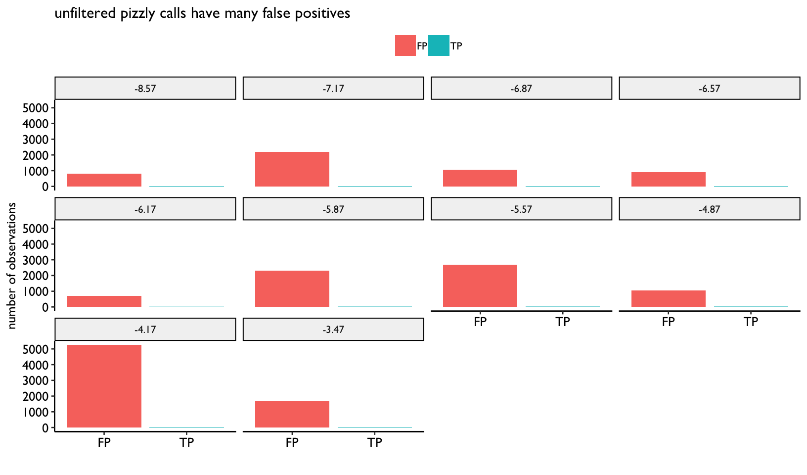
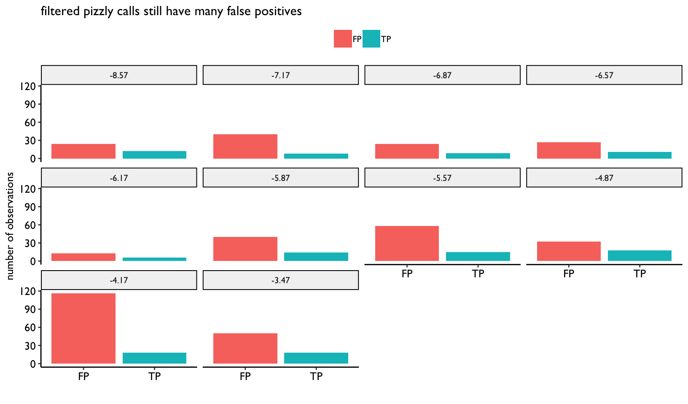
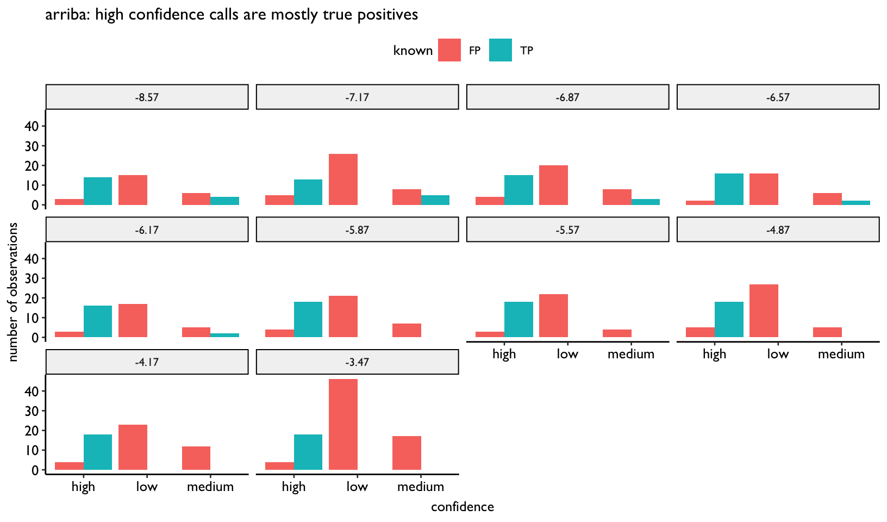

# RNA-seq fusion validation

## PRJNA252360
This dataset is a simulated dilution series of known fusions, described more in
full [here](https://www.ncbi.nlm.nih.gov/bioproject/PRJNA252360/). The
facets on these figures below denote log10 of the concentration of the fusion
spike ins.

### pizzly

#### unfiltered
Unfiltered pizzly calls have an extremely high false positive rate:

#### filtered

Filtering the pizzly calls by requiring there to be evidence of both split reads
(reads with one read in both parts of the fusion) and paired (reads with one
pair in each of the parts of the fusion) results in a lower, but still high
false positive rate. This filtering could definitely be improved upon.

### arriba
Arriba classifies calls as high, medium and low confidence. Here we can see that
focusing on the high confidence calls yields an improved false positive rate.

