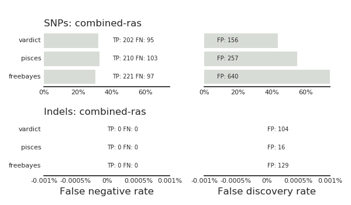
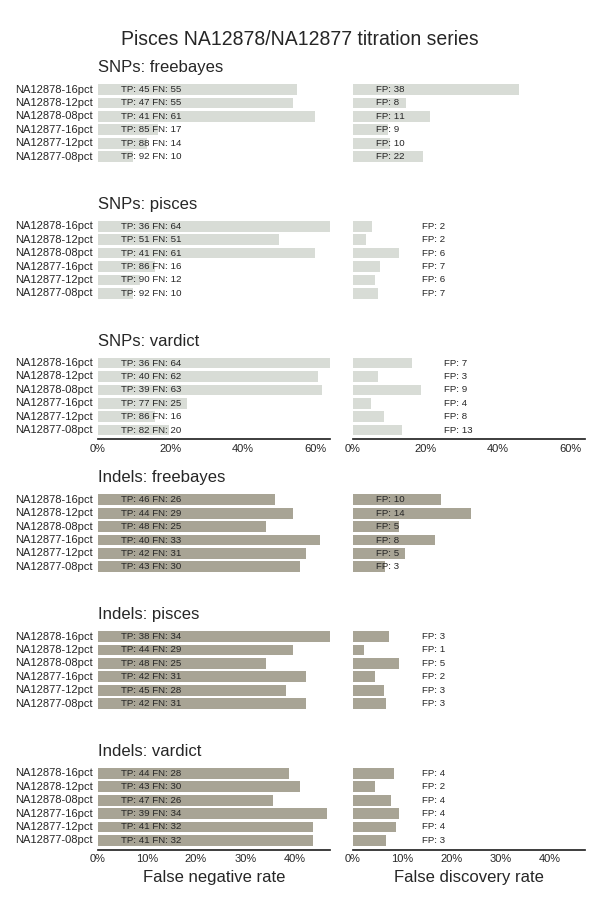
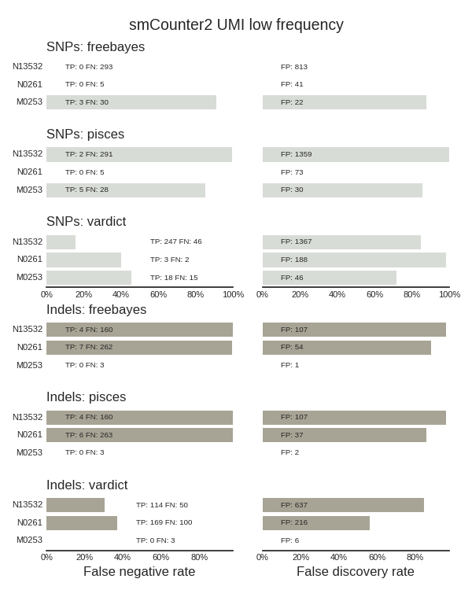

# Low Frequency Somatic calling

Cancer variant calling of low frequency somatic mutations.

## FFPE and tumor-only samples

Uses [truth sets from the Pisces tumor-only variant
caller](https://github.com/bcbio/bcbio_validation_workflows#somatic-low-frequency-variants).

The RAS validation summarizes results from 319 FFPE tumor-only samples, each
containing 1 or 2 validated SNPs in KRAS/NRAS. In the validation we ignored
ploidy calls to provide just detection capabilities of each caller.



- These results are similar to those reported in the Pisces paper, although
  VarDict has better specificity than Pisces, likely due to [additional
  filters in bcbio](http://bcb.io/2016/04/04/vardict-filtering/).
- Pisces variant calling used only the caller (not paired end stitching and
  recalibration).
- VarDict results are similar to Pisces, with slightly less sensitivity and
  slightly better specificity.
- FreeBayes had the most sensitivity but worst precision.

The Titration dataset used NA12878 specific mutations (compared with NA12877)
and compares dilutions of NA12878 in NA12877 (lower frequency mutations; less
NA12878) and dilutions of NA12877 in NA12878 (higher frequency; more NA12878):



- These results don't compare with the paper, where the Pisces team reports
  summarized 99% sensitivity for Pisces and 97% sensitivity for VarDict on SNPs
  ([Table 1](https://www.biorxiv.org/content/biorxiv/early/2018/03/29/291641.full.pdf)).
  Our stratified results are much lower, especially for the lower frequency
  NA12878 mixtures, where we only see 50% or worse sensitivity across the
  callers.
- Pisces has some nice SNP sensitivity improvements over VarDict (and somewhat
  FreeBayes), especially on the NA12878 12 percent sample.
- Pisces, FreeBayes and VarDict have similar sensitivities, although all have
  low sensitivity relative to the Pisces paper reports in Table 1.

Versions:
- GRCh37 genome build
- minimap2 2.10
- pisces 5.2.7.47
- vardict-java 1.5.1
- freebayes 1.1.0.46

## Low frequency UMI-tagged tumor only samples

Using [truth sets from the smcounter2 low frequency UMI based variant
caller
paper](https://github.com/bcbio/bcbio_validation_workflows#somatic-low-frequency-variants),
we looked at the ability of callers to pick up primarily ~0.5% variants in
deeply sequenced, tumor-only samples tagged with UMIs. We called UMI consensus
reads after mapping with
[fgbio](http://fulcrumgenomics.github.io/fgbio/tools/latest/) and then used
consensus reads for calling with multiple callers:



We're not effectively calling low frequency variants with FreeBayes and Pisces
on these samples. We effectively only pick up the low frequency calls with
VarDict, although this also still have much room for improvement in sensitivity.

For FreeBayes and Pisces, we don't see calls at all in the majority of the
concordant variants identified by VarDict. Both callers use low frequency flags;
`--mnvf 0.004` for Pisces and `--min-alternate-fraction 0.004` for FreeBayes.
Here is an example low frequency call picked up by VarDict by not FreeBayes or Pisces:
```
1       206650065       rs41296034      A       G       196     PASS    ADJAF=0;AF=0.0057;BIAS=1:1;DP=4756;HIAF=0.0058;HICNT=27;HICOV=4692;LSEQ=GTGCTTCGAAAGCCCCAGCA;MQ=58.8;MSI=5;MSILEN=1;NM=1.2;ODDRATIO=0;PMEAN=25.4;PSTD=1;QSTD=1;QUAL=41.4;REFBIAS=6:4719;RSEQ=AAAGCGTTCGGGGTGACTGT;SAMPLE=N13532;SBF=1;SHIFT3=0;SN=54;TYPE=SNV;VARBIAS=0:27;VD=27;ANN=G|synonymous_variant|LOW|IKBKE|ENSG00000143466|transcript|ENST00000367120|protein_coding|7/22|c.585A>G|p.Gln195Gln|958/3269|585/2151|195/716||,G|synonymous_variant|LOW|IKBKE|ENSG00000143466|transcript|ENST00000537984|protein_coding|6/21|c.330A>G|p.Gln110Gln|792/2487|330/1896|110/631||,G|upstream_gene_variant|MODIFIER|IKBKE|ENSG00000143466|transcript|ENST00000492570|processed_transcript||n.-3344A>G|||||3344|,G|downstream_gene_variant|MODIFIER|IKBKE|ENSG00000143466|transcript|ENST00000463979|processed_transcript||n.*1594A>G|||||1594|  GT:DP:VD:AD:AF:RD:ALD   0/1:4756:27:4725,27:0.0057:6,4719:0,27
```
