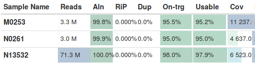
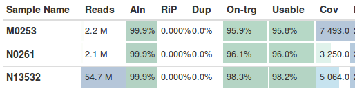
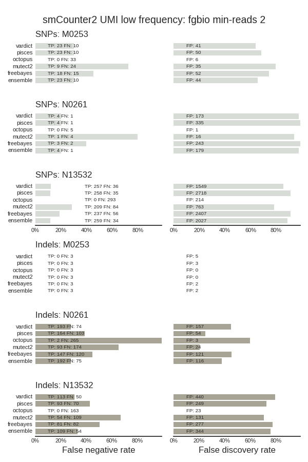
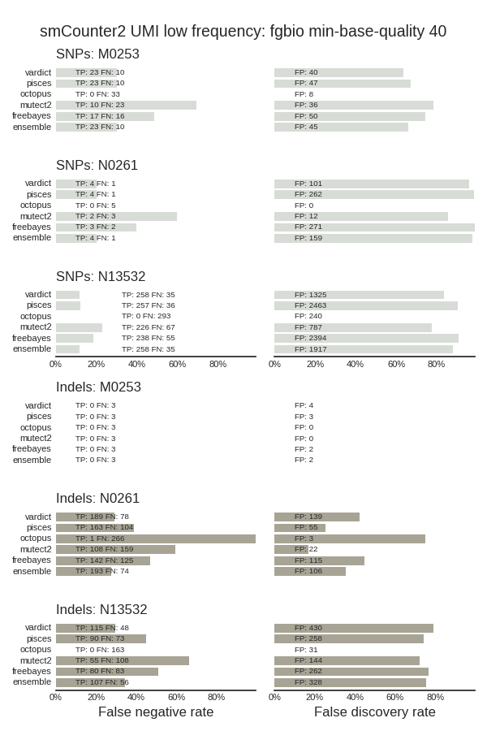
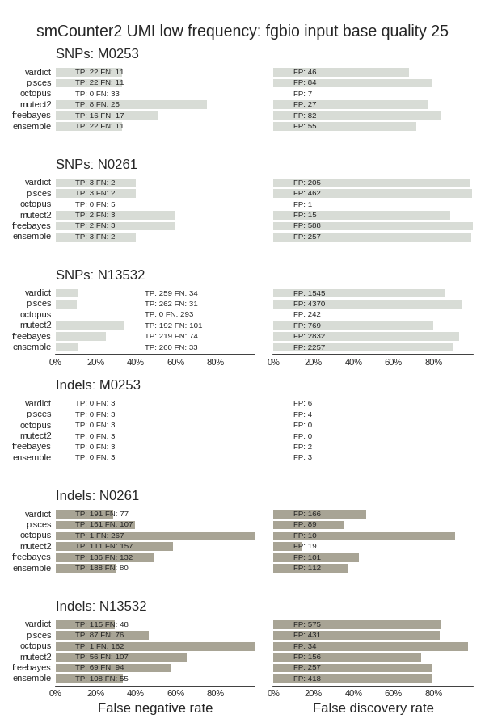
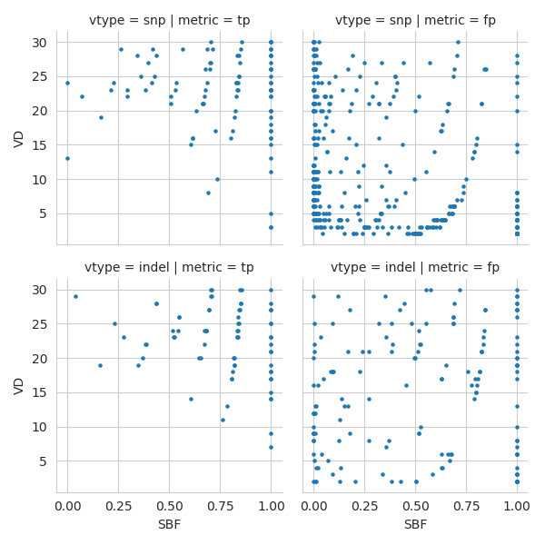
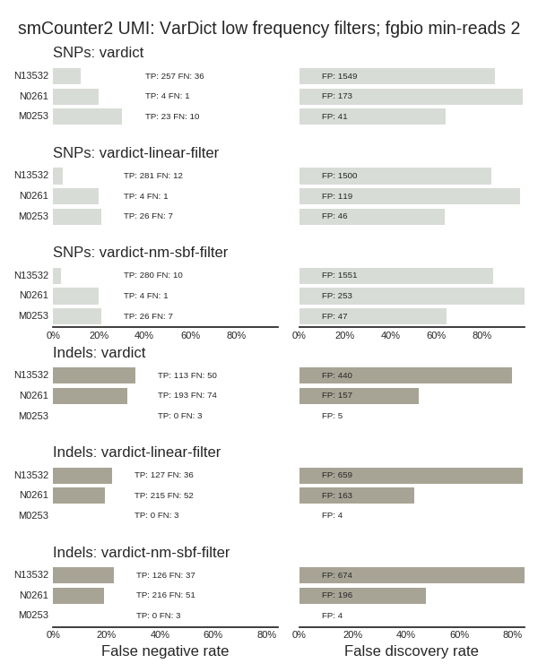
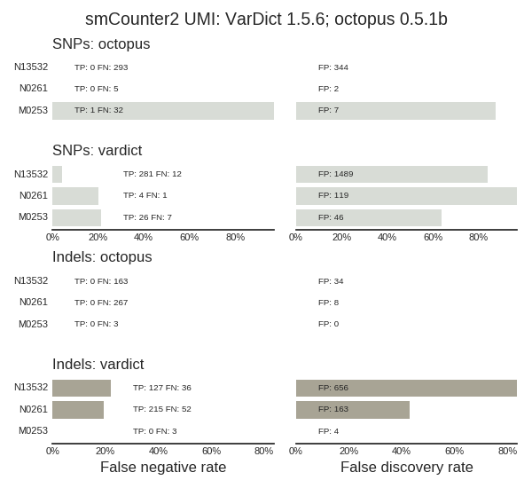

# Low Frequency Somatic calling

Cancer variant calling of low frequency somatic mutations.

## FFPE and tumor-only samples

Uses [truth sets from the Pisces tumor-only variant
caller](https://github.com/bcbio/bcbio_validation_workflows#somatic-low-frequency-variants).

The RAS validation summarizes results from 319 FFPE tumor-only samples, each
containing 1 or 2 validated SNPs in KRAS/NRAS. In the validation we ignored
ploidy calls to provide just detection capabilities of each caller.

- These results are similar to those reported in the Pisces paper, although
  VarDict has better specificity than Pisces, likely due to [additional
  filters in bcbio](http://bcb.io/2016/04/04/vardict-filtering/).
- Pisces variant calling used only the caller (not paired end stitching and
  recalibration).
- VarDict results are similar to Pisces, with slightly less sensitivity and
  slightly better specificity.
- FreeBayes had the most sensitivity but worst precision.

The Titration dataset used NA12878 specific mutations (compared with NA12877)
and compares dilutions of NA12878 in NA12877 (lower frequency mutations; less
NA12878) and dilutions of NA12877 in NA12878 (higher frequency; more NA12878):

- These results don't compare with the paper, where the Pisces team reports
  summarized 99% sensitivity for Pisces and 97% sensitivity for VarDict on SNPs
  ([Table 1](https://www.biorxiv.org/content/biorxiv/early/2018/03/29/291641.full.pdf)).
  Our stratified results are much lower, especially for the lower frequency
  NA12878 mixtures, where we only see 50% or worse sensitivity across the
  callers.
- Pisces has some nice SNP sensitivity improvements over VarDict (and somewhat
  FreeBayes), especially on the NA12878 12 percent sample.
- Pisces, FreeBayes and VarDict have similar sensitivities, although all have
  low sensitivity relative to the Pisces paper reports in Table 1.

Versions:
- GRCh37 genome build
- minimap2 2.10
- pisces 5.2.7.47
- vardict-java 1.5.1
- freebayes 1.1.0.46
- octopus 0.4.1a
- MuTect2 4.0.6.0

## Low frequency UMI-tagged tumor only samples

Using [truth sets from the smcounter2 low frequency UMI based variant
caller
paper](https://github.com/bcbio/bcbio_validation_workflows#somatic-low-frequency-variants),
we looked at the ability of callers to pick up primarily ~0.5% variants in
deeply sequenced, tumor-only samples tagged with UMIs. We called UMI consensus
reads after mapping with
[fgbio](http://fulcrumgenomics.github.io/fgbio/tools/latest/) and then used
consensus reads for calling with multiple callers. We include 4 callers and an
ensemble method that reports variants present in at least 2 callers.

All of the callers have room for improvement in both sensitivity and
specificity. Using an ensemble method indicates that we're consistently calling
similar variants, both for true and false positives. Ensemble approaches
currently don't give us a lot of extra sensitivity and specificity. The callers
have similar blind spots and extra non-somatic calls, and we'll work to
categorize those and see how we can improve generally within bcbio for these
difficult cases.

Pisces required [parameter adjustments](https://github.com/bcbio/bcbio-nextgen/commit/49d0cbb1f6dcbea629c63749e2f9813bd06dcee3) for detection at <1% frequency, thanks to [helpful suggestions from Tamsen Dunn](https://github.com/Illumina/Pisces/issues/14#issuecomment-399756862).

FreeBayes also required changes to call somatic variants at this low frequency.
We needed to [call with high ploidy](https://github.com/ekg/freebayes/issues/272#issuecomment-210982788),
[control memory usage by limiting alleles examming](https://github.com/ekg/freebayes/issues/465)
and then resolve the high ploidy calls back to a diploid representation.

For Octopus we sill need to do additional tweaking for low frequency tumor only calling.
For example: N13532 has 0.5% with 293 SNPs and 164 indels. Octopus only calls 1
passing indel but does have 40 additional calls that are filtered, primarily
because of the FRF filter, which measures the number of reads removed for
calling. So we'd need to tweak in terms of both detecting and sensitivity and
will follow up and work to improve.

## Tweaking fgbio UMI consensus settings

For UMI tagged inputs, a key step is collapsing the initial reads by UMI and
duplication status into consensus called input reads. The
[fgbio](https://github.com/fulcrumgenomics/fgbio) toolkit has highly
configurable approaches to do this and we're exploring how tweaking parameters
can help with improving sensitivity and specificity.

The coverage for the default bcbio fgbio settings are:

### min-reads 2

The biggest improvement, in both quality and speed, comes from setting
`--min-reads 2`. As described in the [fgbio CallMolecularConsensusReads documentation](https://fulcrumgenomics.github.io/fgbio/tools/latest/CallMolecularConsensusReads.html)
this parameter is suitable for deeper sequenced samples. It forces
error correction on all positions since we require at least 2 reads to pass a
read. It also helps with running time since all singletons can be immediately
discarded during processing. Running on the N13532 sample takes 3:22 with
`--min-reads 2` versus 3:53 without it included.

The summary shows the reduction in overall coverage by removing noisier
singleton reads from the consensus:

In the validation, it is effective in removing false positives with minimal
impact on sensitivity. In some cases (NA13532 indels) it reduces
sensitivity, but in others (N0261 indels) it improves it by about the same
amount.

This filter seems like a good default, providing samples are deep
enough. The tricky bit will be determining when we have enough coverage, after
considering duplication, to apply it. We could examine through downsampling
these validation samples or exploring other inputs.

### min-base-quality 40

Another effective filter is `--min-base-quality 40`, which only allows base
calls with a high quality. This effectively performs a similar task as
`--min-reads 2`: the stringencyy requires multiple input bases to call a consensus
position so noisier singleton reads get removed by having too many Ns and
triggering the `--max-no-call-fraction` filter. The sensitivity/specificity
improvements are similar to what we see with `--min-reads 2`, with some similar
tradeoffs on different samples, so it seems worth defaulting to speedier option
rather than using this:

### smcounter2 defaults

Using the smcounter2 paper defaults, `--min-reads 2 --min-input-base-quality 25
--min-base-error-rate 0.2 --min-base-quality 13`

This provides an improvement in specificity at the cost of some specificity, but
does not match the specificity differences seen in the smcounter2 paper. We'll
continue to explore more to help supplement variant calling improvements with
UMI handling and see if we can match the results found in the paper.

### fgbio parameters

CallMolecularConsensusReads

| param | default | bcbio | smcounter2 |
| --- | --- | --- | --- |
| --min-reads | required | 1 | 2  |
| --min-input-base-quality | 10 | 2 | 25 |

FilterConsensusReads

| param | default | bcbio | smcounter2 |
| --- | --- | --- | --- |
| --min-reads | required | 1 | 2 |
| --max-base-error-rate | 0.1  | 0.1  | 0.2 |
| --min-base-quality | required | 13 | 0|

## Validation resources

The consensus BAMs prepared with `--min-reads 2` for the smcounter2 samples are
available from a Google Storage Bucket:

- https://storage.googleapis.com/bcbiodata/validate/smcounter2/M0253-sort-cumi.bam
- https://storage.googleapis.com/bcbiodata/validate/smcounter2/M0253-sort-cumi.bam.bai
- https://storage.googleapis.com/bcbiodata/validate/smcounter2/N0261-sort-cumi.bam
- https://storage.googleapis.com/bcbiodata/validate/smcounter2/N0261-sort-cumi.bam.bai
- https://storage.googleapis.com/bcbiodata/validate/smcounter2/N13532-sort-cumi.bam
- https://storage.googleapis.com/bcbiodata/validate/smcounter2/N13532-sort-cumi.bam.bai

## VarDict low frequency false positive removal

To help increase VarDict sensitivity without increasing low frequency false
positives, we developed a linear filter based for low frequency (<2%) and low
depth (<30) variants. We plotted several metrics for filtering, finding
strand bias (SBF), variant depth (VD) and read mismatches (NM) as the most
discriminatory. Scatter plots of metric combinations showed differences between
true and false positives, but not easy cutoffs for filtering without significant
removal of true positives:

Using [scikit-learn](http://scikit-learn.org/stable/modules/linear_model.html)
we developed a linear model that provided good discrimination on the N13532 test
sample. However, it didn't effectively replicate across multiple datasets,
tending to over filter in higher depth panels with closely spaced mutations. After
cross validation we ended up with a simpler filter on calls that have multiple
mismatches (NM >= 2) and strand bias (SBF < 0.1).

To assess more generally, we incorporated the latest versions of VarDict with
increased sensitivity and compared:

- VarDict 1.5.1 without additional filters
- VarDict 1.5.5 with linear model based filter
- VarDict 1.5.8 with NM and SBF cutoff filter

In comparison with the previous validation with VarDict 1.5.1 and no filter, 
the finalized cutoff based version increased
sensitivity for both SNPs and Indels with little to no increase in false positives:

## Vardict 1.5.6; Octopus 0.5.1b

A new version of VarDict (1.5.6) resolved some issues with the addition of
optional structural variant calling in 1.5.5. It provided more restrictions on
these events to prevent duplicate events which caused failures on some larger
events near boundaries. For low frequency detection, it performs similarly to 1.5.5
and we'll move forward with the new version in bcbio.

Thanks to Daniel Cooke, the new 0.5.1 beta release of Octopus supports [many new
useful features for low frequency UMI detection](https://github.com/luntergroup/octopus/issues/29#issuecomment-422136873).

We tested these out with the recommended parameters from the
the example [UMI configuration](https://github.com/luntergroup/octopus/blob/master/configs/UMI.config).
The only tweak was setting max-haplotypes back to the default of 200
instead of 400. This helped avoid out of memory issues when
running on a [8 core, 30Gb n1-standard-8](https://cloud.google.com/compute/docs/machine-types) machine.
Thanks to tips from Dan, we've greatly improved where octopus is now in these
validations:

We'll continue to tweak to help improve sensitivity, specificity and runtime.

Octopus identifies unique true positives missing in the VarDict calls. All of
these are also called in VarDict, but flagged with LongMSI which avoids calling
in high AT regions. In VarDict we may be able to get some extra sensitivity by
adjusting this flag and examining how we filter in these regions.
