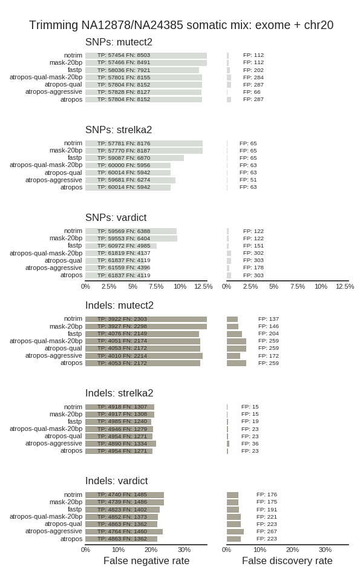

## Read trimming

The goal of this experiment was to explore the impact of 3' read trimming on run
times and quality performance for [a sequenced mixture dataset of two Genome in a Bottle
samples](ftp://ftp-trace.ncbi.nlm.nih.gov/giab/ftp/use_cases/mixtures/UMCUTRECHT_NA12878_NA24385_mixture_10052016/)
simulating a lower frequency set of calls. It has a 90x tumor genome consisting
of 30% NA12878 (tumor) and 70% NA24385 (germline) and a 30x normal genome of
NA24385. Unique NA12878 variants are somatic variations at 15% and 30%.

This sample has slow runtimes with many callers, potentially due to read quality
issues. Inspired by [DNAnexus' work examining problematic reads with
Readshift](https://blog.dnanexus.com/2018-01-16-evaluating-the-performance-of-ngs-pipelines-on-noisy-wgs-data/)
we looked at the impact of 3' quality trimming on runtimes. We also added polyG
trimming to avoid G errors at the end of NovaSeq reads in other datasets, and
polyX trimming to remove other low complexity regions that could contribute to
slow alignment and variant calling times.

Two different trimming methods [atropos](https://github.com/jdidion/atropos) and
[fastp](https://github.com/OpenGene/fastp) had different impacts on read calls
and runtimes. Both callers helped improve sensitivity of SNP and indel
detection. However, atropos improved runtimes for both alignment and variant
calling, while fastp runtimes were about identical to untrimmed. To explore
further, we examined more aggressive polyX tripping with fastp and less
aggressive trimming with atropos. Runtime improvements were dependent on how
aggressively we trimmed polyA tails. With the default settings, atropos is quite
aggressive and will trim the 3' end of any read with a polyA stretch of 3
basepairs or more due to non-anchored 3' trimming and a [default overlap default
of 3](https://atropos.readthedocs.io/en/latest/guide.html#reducing-random-matches).
While this did not impact sensitivity/specificity in this validation set, it
trims too much for low frequency detection where we have the potential to remove
real variants and less datasets to ensure this doesn't happen.

We also examined masking polyX regions in the genome rather, using
polyX stretches of 20bp or more from the [RepeatMasker pre-flagged
datasets](http://www.repeatmasker.org/genomicDatasets/RMGenomicDatasets.html).
These datasets had identical validations to the untrimmed versions. Runtimes for
MuTect2 and VarDict were not improved with only masking, but it greatly improved
strelka2 runtimes over trimming. Using atropos quality trimmed only recover
the validation and runtime improvements seen with atropos quality and 3'
polyX trimming.

This allowed us to identify the contributions different trimming components make
to both validations and runtime. Quality trimming has the primary impact on both
runtime and validation changes, and polyX trimming and masking have minimal
impact in this dataset. We provide runtime tradeoffs and trimming aggressiveness
for the 3 methods in part of an ongoing validation process.

Thanks to the [The University of Melbourne Centre for Cancer Research](
http://mdhs.unimelb.edu.au/our-organisation/institutes-centres-departments/the-university-of-melbourne-centre-for-cancer-research) and [AstraZeneca Oncology](https://www.astrazeneca.com/our-focus-areas/oncology.html) 
for support in running these evaluations.

### Quality changes

Both atropos and fastp improve sensitivity of detection, which appears to be due
to removal of low quality bases at the 3' ends of reads. This is true with
quality only trimming + masking of polyX genome regions:

### Post-trimming Runtime changes

#### minimap2 alignment

Alignment runtimes for full atropos trimmed fastq files
are 75-80% of the original non-trimmed runs, while fastp are
the same: untrimmed (1:10), atropos qual + polyX trim (0:53), atropos qual trim
(0:56), fastp (1:07)

#### Variant calling runtimes for the worst case region (chr20 full region)

atropos improves runtimes, especially for callers like MuTect2 that struggled
with slow runs on this data. fastp has a smaller improvement in runtime.
Aggressive trimming with atropos provides a baseline for potential improvements,
but 3' trimming of anything with polyX stretches greater than 3bp was too
excessive. Quality trimming only with atropos provides validation and runtime
improvements equivalent to also including polyX trimming, so polyX does not
offer large improvements in this dataset. Masking 20bp polyX regions, combined
with quality trimming, provides additional runtime improvements for strelka2,
but does not help with MuTect2 or VarDict:

caller   | untrimmed | atropos | fastp | atropos aggressive | mask 20bp | atropos qual + mask 20bp | atropos qual |
--- | --- | --- | --- | --- | --- | --- | --- |
vardict  |  1:46 |  1:12 67% |  1:25 80% |  1:08 65% | 1:36 90%  | 1:14 67% | 1:11 67% |
mutect2  |  5:59 |  3:45 62% |  5:03 84% |  2:38 44% | 6:14 100% | 3:44 62% | 3:44 62% |
strelka2 |  0:36 |  0:27 75% |  0:32 89% |  0:28 78% | 0:16 44%  | 0:11 31% | 0:27 75% |

### Trimming runtimes

Runtimes to trim reads for a 24Gb input BAM file on a
16 core AWS machine with SSD storage:

- atropos 1:26
- fastp 1:19

### Trimming differences

Adjusting aggressiveness in 3' quality trimming with fastp did not change
variant calling runtimes, suggesting the runtime difference is due to polyX
trimming or that fastp has a different quality trimming algorithm missing
removal of ends that atropos removes.

When examining the top 3' ends remaining after atropos and fastp
trimming, the fastp ends primarily included polyA, polyT and polyC stretches.
The differences in runtime appear to be due to removal of polyA, polyT and polyC
read ends during trimming. polyG stretches, which are often present in new
NovaSeq data, get removed consistently by both callers. The aggressiveness of
trimming 3' ends containing other polyA/T/C stretches determines runtime
improvements by avoid extra computational work aligning and variant calling in
these low complexity region. We're working with the fastp team to discuss
improved approaches to help remove these as part of the fastp trim so the two
methods consistently trim reads.

Top 15 remaining 3' ends for fastp trimming:

     TTTTTTTTTT 33136
     AAAAAAAAAA 14707
     TTTTTTTTTA 4754
     TTTTTTTTTG 4588
     CCCCCCCCCC 4296
     TTTTTTTTGT 2609
     TTTTTTTTTC 2379
     AAAAAAAAAG 2354
     AAAAAAAAAT 1799
     TTTTTTTTGA 1653
     GTGTGTGTGT 1584
     CTTTTTTTTT 1476
     TGTGTGTGTG 1474
     TTTTTTTTAA 1473
     ACACACACAC 1452

For atropos trimming:

     ACTCTGTCTC 4067
     ACTCCATCTC 3961
     GTGTGTGTGT 3670
     ACTCCGTCTC 3634
     CTTCTGCTTG 2576
     CTAAAAATAC 2203
     CACACACACA 2178
     ACACACACAC 2044
     TGGGATTACA 1972
     ATCCCAGCAC 1968
     TGGAATGGAA 1719
     GGAATGGAAT 1679
     TTTTCTTTTC 1538
     CATTCCATTC 1533
     ACTCCAGCCT 1489

## NovaSeq PolyG trimming

Illumina two color chemistry machines, like NovaSeq and NextSeq, produce
[high base quality polyG artifacts at 3' read ends](https://sequencing.qcfail.com/articles/illumina-2-colour-chemistry-can-overcall-high-confidence-g-bases/).
While this dataset does not demonstrate this issue, trimming or polyX filtering
can help avoid the issue.

As an example, here is the depth profile (chromosome, start, end, average depth)
for a ~90x WGS sample over a region on chromosome two, where you can see a
~4000x spike in coverage:

    chr2    32890204        32910204        79.07
    chr2    32909954        32916804        336383.24
    chr2    32917650        32917916        0.27
    chr2    32918369        32938369        93.97
    chr2    32938119        32958119        95.77

This is due to polyG reads piling up at `chr2:32916224-32916626` a polyG stretch
identified by repeatmasker:

    chr2      32916230 32916625 (209276904) +  (G)n           Simple_repeat            1  396

Low frequency callers that avoid downsampling, like VarDict, MuTect2 and
Strelka2 can spend a large amount of runtime trying to resolve variants in these
noise regions. Pre-trimming reads (`trim_reads: atropos` and `adapters: [polyx]`)
or masking polyX regions (`exclude_regions: [polyx]`) will help avoid
these runtime issues.

## CWL and old bcbio runtimes on HPC

We benchmarked runtimes for this somatic validation set on an active production 
HPC SLURM cluster. The goal was to compare the Common Workflow Language
implementation, running using Cromwell, versus the older bcbio specific IPython
approach. This is a exome + chr20 tumor/normal, with trimming,
alignment, 3 variant callers and validation.

The Cromwell SLURM HPC run finished with a walltime of 5:55 and the bcbio
IPython SLURM HPC run finished in 6:18. The IPython based approach allowed 128
cores to ensure that core availability was not a bottleneck.

Our hope was comparable runtimes, with most of the runtime is due to tool
processing and minimal overhead from task orchestration and running.
